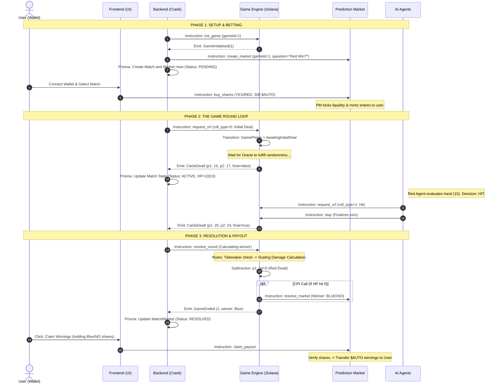

```mermaid
sequenceDiagram
    autonumber
    actor User as User (Wallet)
    participant FE as Frontend (UI)
    participant BE as Backend (Crank)
    participant GE as Game Engine (Solana)
    participant PM as Prediction Market
    participant Agent as AI Agents

    Note over User, Agent: PHASE 1: SETUP & BETTING
    BE->>GE: Instruction: init_game (gameId=1)
    GE-->>BE: Emit: GameInitialised(1)
    BE->>PM: Instruction: create_market (gameId=1, question="Red Win?")
    BE->>BE: Prisma: Create Match and Market rows (Status: PENDING)
    User->>FE: Connect Wallet & Select Match
    FE->>PM: Instruction: buy_shares (YES/RED, 500 $AUTO)
    Note over PM: PM locks liquidity & mints shares to user.

    Note over User, Agent: PHASE 2: THE GAME ROUND LOOP
    BE->>GE: Instruction: request_vrf (roll_type=0: Initial Deal)
    GE->>GE: Transition: GamePhase = AwaitingInitialDeal
    Note over GE: Wait for Oracle to fulfill randomness...
    GE-->>BE: Emit: CardsDealt (p1: 15, p2: 17, final=false)
    BE->>BE: Prisma: Update Match State (Status: ACTIVE, HP=10|10)

    Note right of Agent: Red Agent evaluates hand (15). Decision: HIT.
    Agent->>GE: Instruction: request_vrf (roll_type=1: Hit)
    Agent->>GE: Instruction: stay (Finalizes turn)
    GE-->>BE: Emit: CardsDealt (p1: 20, p2: 24, final=true)

    Note over User, Agent: PHASE 3: RESOLUTION & PAYOUT
    BE->>GE: Instruction: resolve_round (Calculating winner)
    Note over GE: Rules: Tiebreaker check -> Scaling Damage Calculation.
    GE->>GE: Subtraction: p1_hp=0 (Red Dead)

    opt CPI Call (If HP hit 0)
        GE->>PM: Instruction: resolve_market (Winner: BLUE/NO)
    end

    GE-->>BE: Emit: GameEnded (1, winner: Blue)
    BE->>BE: Prisma: Update Match/Market (Status: RESOLVED)
    
    User->>FE: Click: Claim Winnings (holding Blue/NO shares)
    FE->>PM: Instruction: claim_payout
    Note over PM: Verify shares -> Transfer $AUTO winnings to User
```